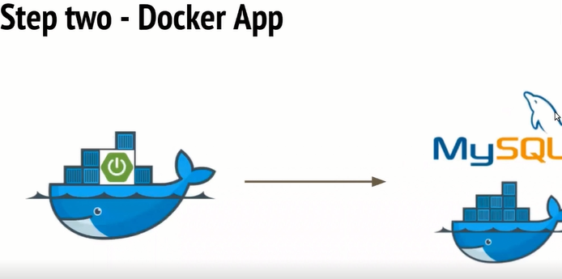
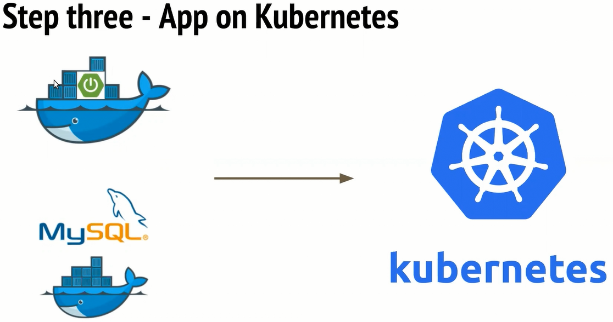
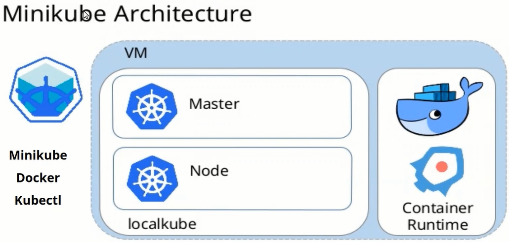

#java-kubernets-dio

Projeto para estudo do Kubernetes,Docker, Minikube e Kubectl.

O projeto original foi dividido em 4 partes, descrito no passo a passo.  

    1 - Roda aplicação local e banco de dados no docker
    2 - Aplicação java e banco de dados no Docker
    3 - Criação do cluster Kubernetes local com o container docker 
    4 - Debbug da aplicação

O projeto tem o seguinte setup:

    -Docker - empacotamento da aplicação no container
    -Minikube - simulação de um cluster kubernets local
    -Kubectl - linha de comando pra interagir com o cluster
    -GNU make(opcional) - Automatizar tarefas(execução dos comandos)
    Os comandos estão diponíveis no arquivo Makefile.

# Java and Kubernetes

Show how you can move your spring boot application to docker and kubernetes.
This project is a demo for the series of posts on dev.to
https://dev.to/sandrogiacom/kubernetes-for-java-developers-setup-41nk


### Requirements:

**Docker and Make (Optional)**

**Java 15**

Help to install tools:

https://github.com/sandrogiacom/k8s

### Build and run application:

Spring boot and mysql database running on docker

**Clone from repository**
```bash
git clone https://github.com/sandrogiacom/java-kubernetes.git
```

**Build application**
```bash
cd java-kubernetes
mvn clean install
```

**Start the database**
```bash
make run-db
```

**Run application**
```bash
java --enable-preview -jar target/java-kubernetes.jar
```

**Check**

http://localhost:8080/app/users

http://localhost:8080/app/hello




Create a Dockerfile:

```yaml
FROM openjdk:15-alpine
RUN mkdir /usr/myapp
COPY target/java-kubernetes.jar /usr/myapp/app.jar
WORKDIR /usr/myapp
EXPOSE 8080
ENTRYPOINT [ "sh", "-c", "java --enable-preview $JAVA_OPTS -jar app.jar" ]
```

**Build application and docker image**

```bash
make build
```

Create and run the database
```bash
make run-db
```

Create and run the application
```bash
make run-app
```

**Check**

http://localhost:8080/app/users

http://localhost:8080/app/hello

Stop all:

`
docker stop mysql57 myapp
`



We have an application and image running in docker
Now, we deploy application in a kubernetes cluster running in our machine

Prepare

### Start minikube

`
make k-setup
`
 start minikube, enable ingress and create namespace dev-to

### Check IP

`
minikube -p dev.to ip
`

### Minikube dashboard

`
minikube -p dev.to dashboard
`

### Deploy database

create mysql deployment and service

`
make k-deploy-db
`

`
kubectl get pods -n dev-to
`

OR

`
watch k get pods -n dev-to
`


`
kubectl logs -n dev-to -f <pod_name>
`

`
kubectl port-forward -n dev-to <pod_name> 3306:3306
`

## Build application and deploy

build app

`
make k-build-app
` 

create docker image inside minikube machine:

`
make k-build-image
`

OR

`
make k-cache-image
`  

create app deployment and service:

`
make k-deploy-app
` 

**Check**

`
kubectl get services -n dev-to
`

To access app:

`
minikube -p dev.to service -n dev-to myapp --url
`

Ex:

http://172.17.0.3:32594/app/users
http://172.17.0.3:32594/app/hello

## Check pods

`
kubectl get pods -n dev-to
`

`
kubectl -n dev-to logs myapp-6ccb69fcbc-rqkpx
`

## Map to dev.local

get minikube IP
`
minikube -p dev.to ip
` 

Edit `hosts` 

`
sudo vim /etc/hosts
`

Replicas
`
kubectl get rs -n dev-to
`

Get and Delete pod
`
kubectl get pods -n dev-to
`

`
kubectl delete pod -n dev-to myapp-f6774f497-82w4r
`

Scale
`
kubectl -n dev-to scale deployment/myapp --replicas=2
`

Test replicas
`
while true
do curl "http://dev.local/app/hello"
echo
sleep 2
done
`
Test replicas with wait

`
while true
do curl "http://dev.local/app/wait"
echo
done
`

## Check app url
`minikube -p dev.to service -n dev-to myapp --url`

Change your IP and PORT as you need it

`
curl -X GET http://dev.local/app/users
`

Add new User
`
curl --location --request POST 'http://dev.local/app/users' \
--header 'Content-Type: application/json' \
--data-raw '{
    "name": "new user",
    "birthDate": "2010-10-01"
}'
`

## Part four - debug app:

add   JAVA_OPTS: "-agentlib:jdwp=transport=dt_socket,address=*:5005,server=y,suspend=n"
 
change CMD to ENTRYPOINT on Dockerfile

`
kubectl get pods -n=dev-to
`

`
kubectl port-forward -n=dev-to <pod_name> 5005:5005
`

## KubeNs and Stern

`
kubens dev-to
`

`
stern myapp
` 

## Start all

`make k:all`


## References

https://kubernetes.io/docs/home/

https://minikube.sigs.k8s.io/docs/

## Useful commands

```
##List profiles
minikube profile list

kubectl top node

kubectl top pod <nome_do_pod>
```
